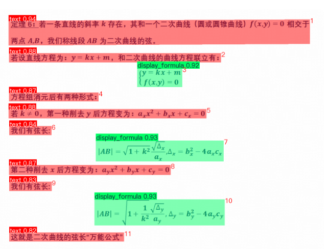
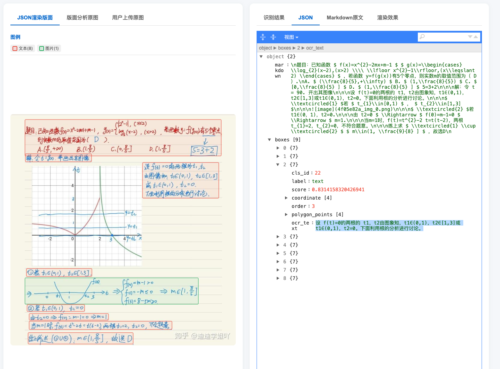
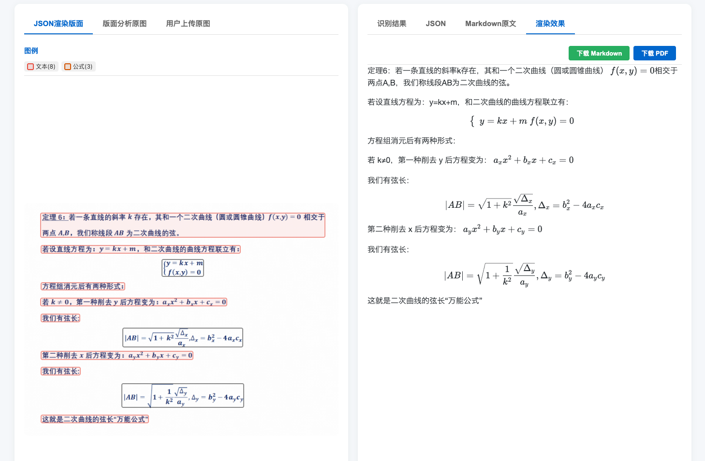

# OCR Layout Recognition Service

基于 PaddleX PP-DocLayoutV3 + vLLM 视觉语言模型的文档版面分析与 OCR 识别服务。

## 功能特性

- **版面分析**：自动检测文档中的各类元素（标题、正文、表格、图片、公式等 20+ 种类型）
- **OCR 识别**：基于视觉语言模型的文本识别，支持并发处理
- **Markdown 输出**：将识别结果自动构建为 Markdown 格式
- **语义重排序**：使用 LLM 根据语义连贯性调整元素阅读顺序
- **可视化查看**：提供 Web 界面查看识别结果

## 支持的文档元素类型

| 类型 | 说明 |
|------|------|
| doc_title | 文档标题 |
| header | 页眉 |
| paragraph_title | 段落标题 |
| text / content | 正文文本 |
| table | 表格 |
| image / chart | 图片/图表 |
| display_formula | 行间公式 |
| inline_formula | 行内公式 |
| figure_title | 图注 |
| footer / footnote | 页脚/脚注 |
| reference | 参考文献 |
| algorithm | 算法块 |
| vertical_text | 竖排文本 |
| seal | 印章 |
| ... | 更多类型 |

## 效果展示

### 版面分析示例



### OCR 识别示例



### Markdown 输出示例



## 项目结构

```
ocrserver/
├── ocr_server/
│   ├── app.py              # FastAPI 主应用
│   ├── model.py            # PaddleX 版面识别模型
│   ├── vllm_client.py      # vLLM OpenAI-compatible 客户端
│   ├── storage.py          # SQLite 存储模块
│   ├── downloadmodel.py    # 模型下载工具
│   ├── requirements.txt    # Python 依赖
│   ├── view/               # 前端页面
│   │   ├── index.html      # 首页
│   │   ├── docs.html       # API 文档
│   │   ├── console.html    # 控制台
│   │   └── viewer.html     # 可视化查看器
│   └── target/             # 数据存储（自动创建）
│       ├── images/          # 上传图片存储
│       └── recognitions.db  # SQLite 数据库
├── .gitignore
├── README.md
└── docs/                   # 文档（效果展示图放这里）
    └── images/
```

## 快速开始

### 1. 安装依赖

```bash
cd ocr_server
pip install -r requirements.txt
```

### 2. 启动 vLLM 服务

```bash
# 示例；模型名和启动参数请按所用视觉模型调整
vllm serve /path/to/glm-ocr \
  --served-model-name glm-ocr \
  --host 0.0.0.0 \
  --port 8001
```

### 3. 启动 OCR 服务

```bash
cd ocr_server
uvicorn app:app --host 0.0.0.0 --port 8000 --reload
```

### 4. 访问服务

- 首页：http://localhost:8000/
- API 文档：http://localhost:8000/docs
- 控制台：http://localhost:8000/console
- 可视化查看器：http://localhost:8000/viewer?id={识别ID}

## API 文档

### POST /ocr

版面识别 + OCR，返回识别结果 ID。

**请求**：
- `file`: 图片文件

**响应**：
```json
{
  "id": "abc12345",
  "image": "abc12345_uploaded.png",
  "status": "success",
  "results": [...]
}
```

### POST /markdown

图片识别为 Markdown 格式。

**请求**：
- `file`: 图片文件

**响应**：
```json
{
  "id": "abc12345",
  "image": "abc12345_uploaded.png",
  "status": "success",
  "markdown": "# 文档标题\n\n正文内容..."
}
```

### GET /view/{rec_id}

查看识别结果。

### GET /list

列出所有识别记录。

### GET /image/{filename}

获取存储的图片文件。

## 配置说明

### vLLM 服务配置

客户端使用 vLLM 的 OpenAI-compatible API。默认连接 `http://127.0.0.1:8001/v1`：

```bash
export VLLM_BASE_URL=http://localhost:8001/v1
export VLLM_API_KEY=EMPTY
export VLLM_MODEL=glm-ocr
export VLLM_MAX_TOKENS=4096
export VLLM_TIMEOUT=120
```

### 重排序模型

设置 `VLLM_REORDER_MODEL` 可启用语义重排序；留空则关闭：

```bash
export VLLM_REORDER_MODEL=your-text-model
```

## 技术栈

- **FastAPI** - Web 框架
- **PaddleX PP-DocLayoutV3** - 版面分析模型
- **vLLM OpenAI-compatible API** - 视觉语言模型 OCR
- **SQLite** - 结果存储
- **OpenCV** - 图像处理
